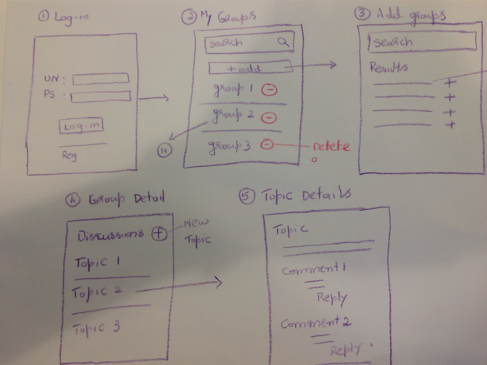

#FlickrGroup: an iOS app that focuses on the Flickr Group and Social features

#Overview

The official Flickr! app does not expose all the Flickr! Group features,
it only shows the photos from groups. This iOS app adds other missing
features such as group management (search for groups, join and leave a
group) and group discussion (create new topic, comment on existing
topic, etc.)

#Design

Login Screen: enter username and password to login, or register for new
account.

My Groups Screen: after successful login, a list of user's groups will
be displayed. A search box on the top helps to filter the list of groups. An `add group` button is used to help user search for new groups to add.

Add Groups Screen: clicking on `add group` button takes user to this
screen. It has a search box to show the matching groups. The user can
click on `add` button/icon next to the group to join the groups. The
user can also click on the group table cell to Group Detail Screen (as a
visitor) to explore a bit before decide to join or not.

Group Detail Screen: this screen should have two slightly different
mode. When the user is a member of the group, it will show create new
topic, reply to existing topic buttons. When the user is not a member,
it only shows the current topics. Clicking on a topic takes the user to
Topic Detail Screen.

Topic Detail Screen: shows the topic discussion thread history. If the
user is a member, it also allows user to make comments and reply to
existing comments.  
